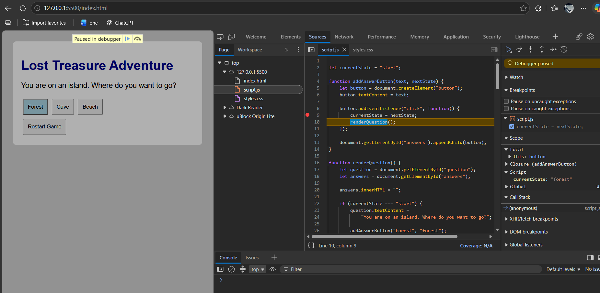
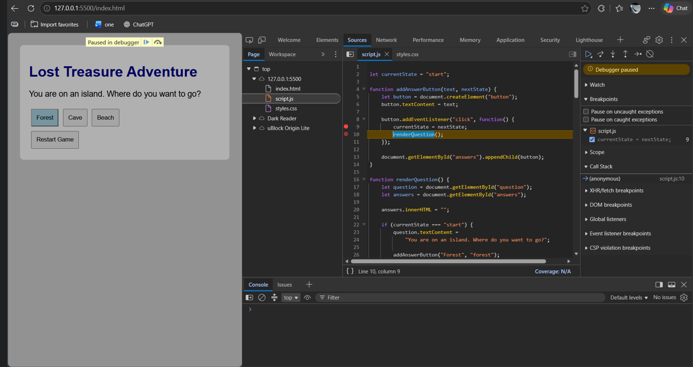
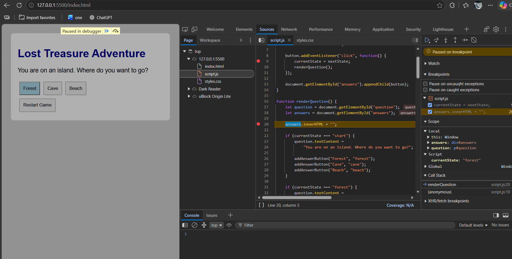
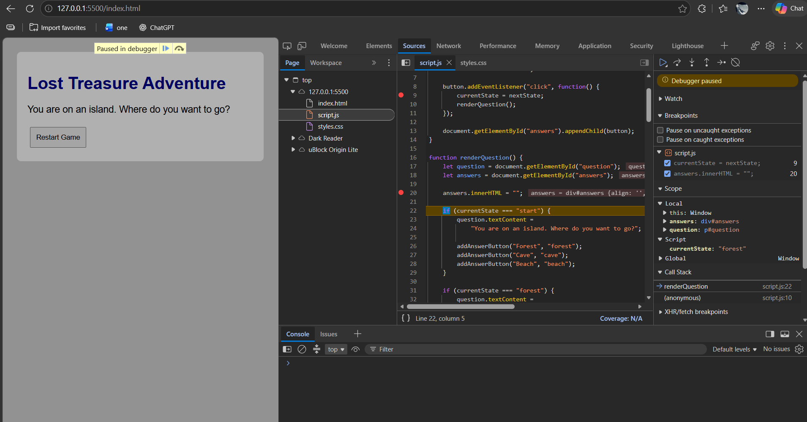
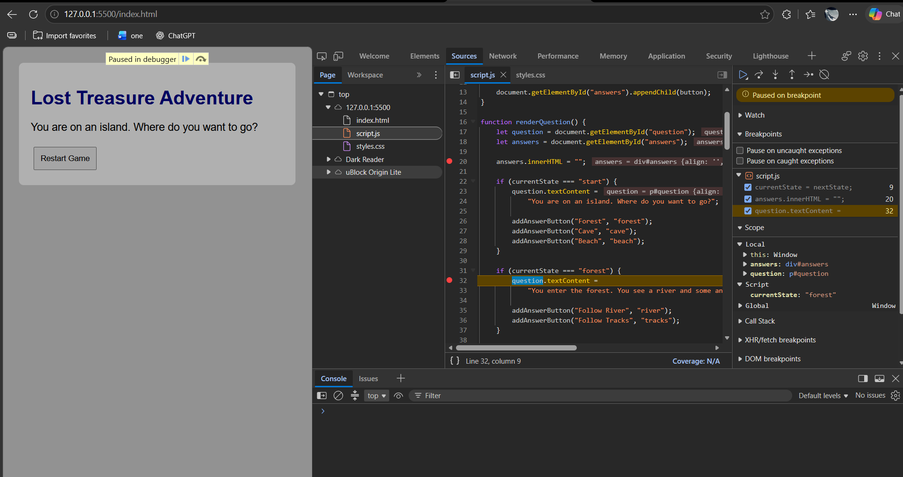

# Debugging Steps

### Screenshot 1 - Breakpoint 1 Before
I clicked Forest and the debugger stopped at line 9.

### Screenshot 2 - Breakpoint 1 After
I checked the code and saw that the state changed to forest.

### Screenshot 3 - Breakpoint 2 Before
I stopped at line 20 to check the answer buttons.

### Screenshot 4 - Breakpoint 2 After
I moved to the next line and the old buttons were cleared.

### Screenshot 5 - Breakpoint 3 Before
I stopped at line 32 to check the forest question.

### Screenshot 6 - Breakpoint 3 After
I moved forward and checked the new forest choices.

### What I Learned
I learned how to use breakpoints and check my code step by step.